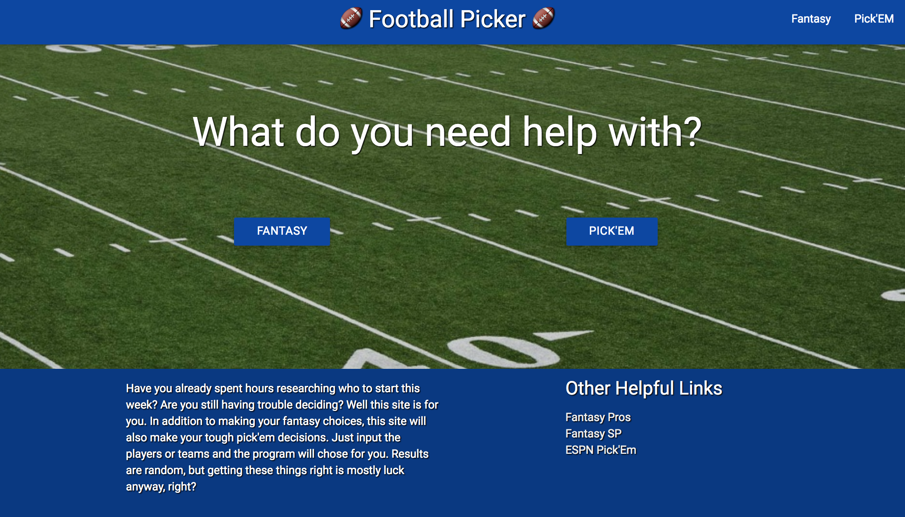
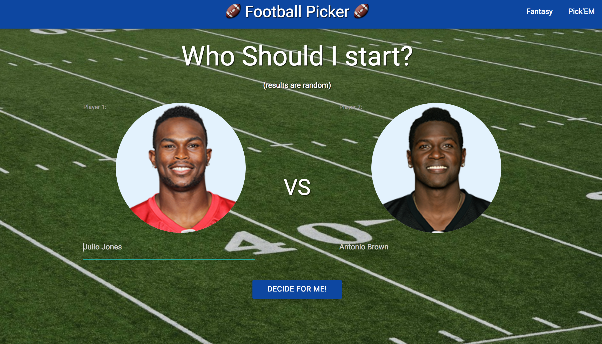
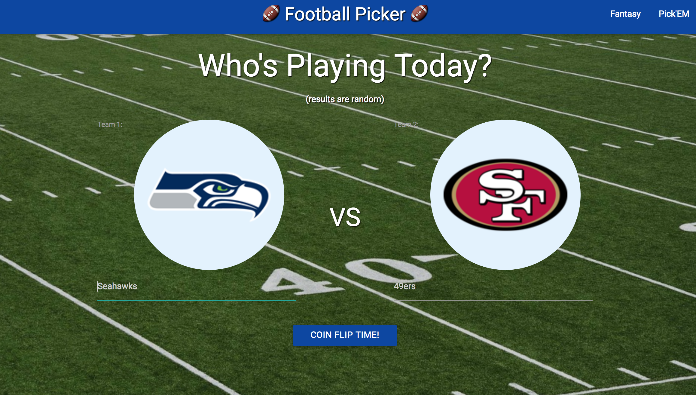

# Q1-Project-Football-Picker

http://stringer86-fantasy-football.surge.sh/

The name of this project is Football Picker (name likely to change).

Fantasy Football has become ubiquitous in the United States.  Millions of people play every year and most of them have the same problem:
"Who should I start this week?".  There are a number of websites that exist with "expert" predictions but no one really knows how a player will perform each week.  This site is intended to help people make a final decision on who to put in their starting lineup.  The people who
would visit my site are people who have already read "expert" predictions but need a little extra help deciding.  One function of this site
is to make their decision for them.

The other function of this site is to help people decide who to pick in "Pick'Em" leagues.  In a Pick'Em league, people choose who will win every week.  Some games are easy to pick, but others are more difficult.  This site chooses who will win any given game any given week.  Again, no one know what will happen any given Sunday so this site helps with that decision.

This project uses the CBS sports api
